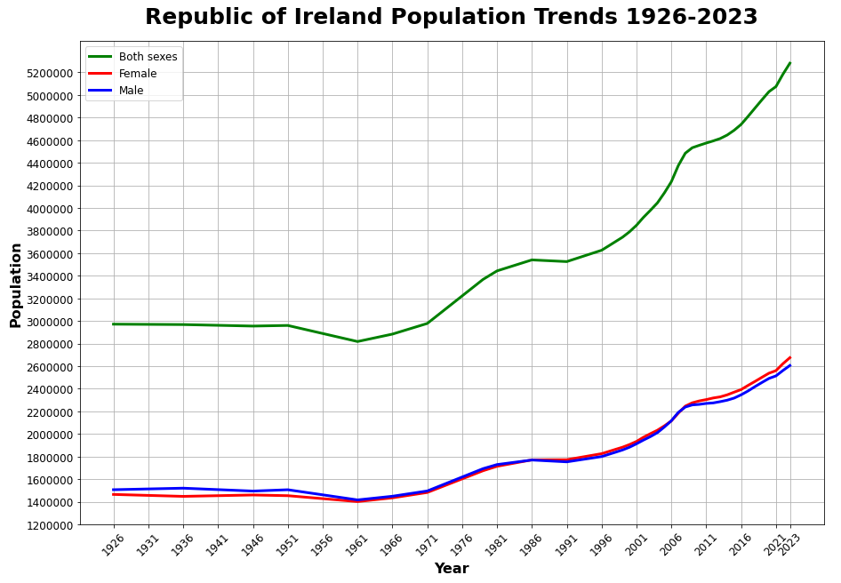

**CCT College Dublin Continuous Assessment**

## Learning Outcomes

Please note this is not the assessment task. The task to be completed is detailed on the next page.  
This CA will assess student attainment of the following minimum intended learning outcomes:

**Programming for DA**
- Debate the selection of programming concepts in the design of programmatic solutions in terms of paradigm and language selection. (Linked to PLO 1).
- Design and implement algorithms for use within the context of data analytics. (Linked to PLO 2).

**Statistics for Data Analytics**
- Explore and evaluate datasets using descriptive statistical analyses. (PLO 1)
- Apply statistical analysis to appropriate datasets and critique the limitations of these models (PLO 24)
- Utilise current software tools and languages to produce and document result sets from existing data (e.g. spreadsheets, R, Python). (PLO 14)

**Machine Learning for Data Analysis**
- Develop a machine learning strategy for a given domain and communicate effectively to team members, peers, and project stakeholders the insight to be gained from the interpreted results. (Linked to PLO 1, PLO 4, PLO 6)
- Implement a range of classification and regression techniques and detail/document their suitability for a variety of problem domains. (Linked to PLO 5)
- Critically evaluate the performance of Machine Learning models propose strategies to optimize performance. (Linked to PLO 3)

**Data Preparation & Visualisation**
- Discuss the concepts, techniques, and processes underlying data visualization to critically evaluate visualization approaches with respect to their suitability for different problem areas. (linked to PLO 1)
- Programmatically implement graphical methods to identify issues within a data set (missing, out of range, dirty data) (linked to PLO 3, PLO 5)
- Engineer new features selection in data with the goal of improving the performance of machine learning models. (linked to PLO 2, PLO 4)

---

## Attainment of the Learning Outcomes

Attainment of the learning outcomes is the minimum requirement to achieve a Pass mark (40%). Higher marks are awarded where there is evidence of achievement beyond this in accordance with QQI Assessment and Standards Revised 2013 and summarized in the following table:

| Percentage Range | CCT Performance Description | QQI Description of Attainment |
|------------------|-----------------------------|-------------------------------|
| 90% +            | Exceptional                 | Achievement includes that required for a Pass and in most respects is significantly and consistently beyond this |
| 80 – 89%         | Outstanding                 |                               |
| 70 – 79%         | Excellent                   |                               |
| 60 – 69%         | Very Good                   | Achievement includes that required for a Pass and in many respects is significantly beyond this |
| 50 – 59%         | Good                        | Attains all the minimum intended programme learning outcomes  |
| 40 – 49%         | Acceptable                  |                               |
| 35 – 39%         | Fail                        | Nearly (but not quite) attains the relevant minimum intended learning outcomes |
| 0 – 34%          | Fail                        | Does not attain some or all of the minimum intended learning outcomes |

Please review the CCT Grade Descriptor available on the module Moodle page for a detailed description of the standard of work required for each grade band.  

The grading system in CCT is the QQI percentage grading system and is in common use in higher education institutions in Ireland. The pass mark and thresholds for different grade bands may be different from what you have experienced in the higher education system in other countries. CCT grades must be considered in the context of the grading system in Irish higher education and not assumed to represent the same standard the percentage grade reflects when awarded in an international context.

---

## Assessment Task

Students are advised to review and adhere to the submission requirements documented after the assessment task.

**Scenario: Population in Ireland**

A large amount of data has been collected by The Central Statistics Office in Ireland in relation to the population of Ireland. This data is available at:  

[https://data.cso.ie/product/pme](https://data.cso.ie/product/pme)

You are required to choose a particular area of interest and formulate the appropriate questions for modelling and analysis. For example (but not limited to):
- Annual Population Change
- Immigration and Migration
- Population Forecasting

You are required to collect, process, analyze, and interpret the data in order to identify possible issues/problems at present and make predictions/classifications in regard to the future. This analysis will rely on the available data from CSO and any additional data you deem necessary (with supporting evidence) to support your hypothesis for this scenario.

This will require you to employ critical analysis of not only the domain of choice but also for the regression and or classification that you undertake.

**Note:** This is an academic exercise and not a hypothetical report to the CSO.

---

### Criteria of Analysis

**Statistics:** (Graded out of 100)
- You need to analyze the chosen dataset using statistical logic and statistical techniques. **Note:** ALL Statistical work MUST be carried out using Python.
1. Summarize your dataset clearly using relevant descriptive statistics and appropriate plots. These should be carefully motivated and justified and clearly presented. You should critically analyze your findings in addition to including the necessary Python code output and plots in the report. You are required to plot at least three graphs. [0-35]
2. Use two discrete distributions (Binomial and/or Poisson) in order to explain/identify some information about your dataset. You must explain your reasoning and the techniques you have used. Visualize your data and explain what happens with the large samples in these cases. You must work with Python and your mathematical reasoning must be documented in your report. [0-30]
3. Use Normal distribution to explain or identify some information about your dataset. [0-20]
4. Explain the importance of the distributions used in points 2 and 3 in your analysis. Justify the choice of the variables and explain if the variables used for the discrete distributions could be used as normal distribution in this case. [0-15]

**Data Preparation and Visualization:** (Graded out of 100)
1. You must perform appropriate EDA on your dataset rationalizing and detailing why you chose the specific methods and what insight you gained. [0-20]
2. You must also rationalize, justify, and detail all the methods used to prepare the data for ML. [0-30]
3. Appropriate visualizations must be used to engender insight into the dataset and to illustrate your final insights gained in your analysis. [0-20]
4. All design and implementation of your visualizations must be justified and detailed in full, making reference to Tufts Principles [0-30]

**Machine Learning for Data Analytics:** (Graded out of 100)
1. Explain which project management framework (CRISP-DM, KDD, or SEMMA) is required for a data science project. Discuss and justify with real-life scenarios. Provide an explanation of why you chose a supervised, unsupervised, or semi-supervised machine learning technique for the dataset you used for ML modeling. [0 - 20]
2. Machine learning models have a wide range of uses including prediction, classification, and clustering. It is advised that you assess several approaches (at least two) choose appropriate hyperparameters for the optimal outcomes of Machine Learning models using an approach of hyperparameter tuning such as GridSearchCV or RandomizedSearchCV. [0 - 30]
3. Show the results of two or more ML modeling comparisons in a table or graph format. Review and critically examine the machine learning models' performance based on the selected metric for supervised, unsupervised, and semi-supervised approaches. [0 - 30]
4. Demonstrate the similarities and differences between your Machine Learning modelling results using the tables or visualizations. Provide a report along with an explanation and interpretation of the relevance and effectiveness of your findings. [0 - 20]

**Programming:** (Graded out of 100)
1. The project must be explored programmatically, this means that you must implement suitable Python tools (code and/or libraries) to complete the analysis required. All of this is to be implemented in a Jupyter Notebook. Your codebook should be properly annotated. The project documentation must include sound justifications and explanation of your code choices (code quality standards should also be applied). [0-50]
2. Please recall that simply performing the analyses is a requirement to achieve a grade of PASS. Critical analysis and independent research are required for higher marks.
3. Briefly discuss your use of aspects of various programming paradigms in the development of your project. For example, this may include (but is not limited to) how they influenced your design decisions or how they helped you solve problems. Note that marks may not be awarded if the discussion does not involve your specific project. [0-50]

**CA1 NOTE:** DO NOT ZIP YOUR SUBMISSION FILES. ALL FILES MUST BE SUBMITTED INDIVIDUALLY.
Submissions that are suspected of plagiarism and/or inclusion of AI (CHATGBT, BARD, etc.) generated content will be referred to the college authorities.
**Note:** ALL Students are required to use Git for any Assignments that they are working on.
This means that ALL changes must be committed to Git during your assignment (not just a single commit at the end!). This is to allow you to display your incremental progress throughout the assessments, give you practice for your capstone/thesis, allows you to create an online portfolio that can be used to showcase your work, and to ensure that there are no problems with final uploads (as all your work will be available on GitHub). It is expected that there will be a minimum of 10 commits (with many of you making very many more). You may Only use your CCT email for your git account; private/work email-based accounts will not be accepted. You must also include ALL your lecturer's CCT emails as a collaborator on your account.

---

## Submission Requirements

All assessment submissions must meet the minimum requirements listed below. Failure to do so may have implications for the mark awarded.

All assessment submissions must:
- 4000 (+/- 10%) words in report (not including code, code comments, titles, references, or citations)
- Report submission MUST be a word document only (No PDF’s!)
- Code in a Jupyter Notebook file only but may be referenced in the word document.
- GITHUB Link
- Be submitted by the deadline date specified or be subject to late submission penalties
- Be submitted via Moodle upload
- Use Harvard Referencing when citing third-party material
- Be the student’s own work
- Include the CCT assessment cover page

---

## Additional Information

- Lecturers are not required to review draft assessment submissions. This may be offered at the lecturer’s discretion.
- In accordance with CCT policy, feedback to learners may be provided in written, audio, or video format and can be provided as individual learner feedback, small group feedback, or whole class feedback.
- Results and feedback will only be issued when assessments have been marked and moderated/reviewed by a second examiner.
- Additional feedback may be requested by contacting the appropriate lecturer. Additional feedback may be provided as individual, small group, or whole class feedback. Lecturers are not obliged to respond to email requests for additional feedback where this is not the specified process or to respond to further requests for feedback following the additional feedback.
- Following receipt of feedback, where a student believes there has been an error in the marks or feedback received, they should avail of the recheck and review process and should not attempt to get a revised mark/feedback by directly approaching the lecturer. Lecturers are not authorized to amend published marks outside of the recheck and review process or the Board of Examiners process.
- Students are advised that disagreement with an academic judgement is not grounds for review.
- For additional support with academic writing and referencing, students are advised to contact the CCT Library Service.
- For additional support with subject matter content, students are advised to contact the CCT Student Mentoring Academy.
- For additional support with IT subject content, students are advised to access the CCT Support Hub.

__________________________________________________________________________________________________________________________________________________________________________

# Commencement of First Assignment for Semester One
__________________________________________________________________________________________________________________________________________________________________________

# Title
**Recent Demographic History in the Republic of Ireland**

# Details

**MSc in Data Analytics (SB+) - Sept 2023 - 2023 - YR1**

Author: Jose Maria Rico Leal

e-mail: sba23021@student.cct.ie

Student ID: sba23021

GitHub Link:

[https://github.com/JoseRicoCct/CA1_Integrated_Assesment_MSc_Data_Analytics_CCT_Semester_1.git](https://github.com/JoseRicoCct/CA1_Integrated_Assesment_MSc_Data_Analytics_CCT_Semester_1)

## **Abstract**

*Through the process of developing this paper, I have learned more about the Republic of Ireland in six weeks than I have in the five years I have been living here. \
Demographics is like the DNA for a society, by looking at them we can find how the population is getting along, by looking at factors such as economic status or education level.*

*Migration also plays a key role shaping demographics, the Republic of Ireland has seen in many occasions the two sides of the coin, its people emigration and new people immigrating.*

# 

# Index

- [Abstract](#abstract)
- [1. Introduction](#1-introduction)
- [2. Data Preparation and Visualization](#2-data-preparation-and-visualization)
  - [2.1. EDA](#21-eda)
  - [2.2. Method Justification](#22-method-justification)
  - [2.3. Visualizations](#23-visualizations)
    - [2.3.1. Population Overview](#231-population-overview)
    - [2.3.2. Population Growth](#232-population-growth)
    - [2.3.3. Population Pyramids](#233-population-pyramids)
    - [2.3.4. Population Density Maps](#234-population-density-maps)
    - [2.3.5. Migration Analysis](#235-migration-analysis)
  - [2.4. Tufte’s Principles](#24-tuftes-principles)
- [3. Statistical Analysis](#3-statistical-analysis)
  - [3.2. Binomial and Poisson Distribution](#32-binomial-and-poisson-distribution)
    - [3.2.1. Binomial](#321-binomial)
    - [3.2.2. Poisson](#322-poisson)
    - [3.2.3. Increasing Sample Size for Binomial and Poisson Distributions](#323-increasing-sample-size-for-binomial-and-poisson-distributions)
  - [3.3. Normal Distribution](#33-normal-distribution)
  - [3.4. Importance of Binomial and Poisson, Variable Justification, Discrete Variables in a Normal Distribution](#34-importance-of-binomial-and-poisson-variable-justification-discrete-variables-in-a-normal-distribution)
- [4. Machine Learning](#4-machine-learning)
  - [4.2. ML Models](#42-ml-models)
  - [4.3. Results of ML Models Selected](#43-results-of-ml-models-selected)
  - [4.4. Similarities and Differences of ML Selected](#44-similarities-and-differences-of-ml-selected)
- [5. Programming](#5-programming)
  - [5.1. Programming Paradigms Used](#51-programming-paradigms-used)
- [6. Conclusion](#6-conclusion)
- [7. References](#7-references)
- [8. License](#8-license)

# 1. Introduction

The aim of this study is to highlight the population changes of the Republic of Ireland. Fifteen datasets are available to complete this study and here it goes some detail about how they are formed:

- Population changes. We have seven datasets organized in: four types of datasets, first one we have age group by sex, second age group by sex and region, third one year by component as in *“Annual births”, “Annual deaths” ….* Last type goes year by sex and nationality. This data will be used to understand how the population grew and is distributed in Ireland.

- Migratory flows. There are four datasets each one of them has a distinct attribute, first type age group by sex, second one country by sex, third education level and fourth one economic status. These datasets are key to identify which type of immigrants or emigrants get in and out of the country.

- Three datasets explain emigration, attributes across the datasets are almost the same, year by sex and nationality, the only difference between them is year length, 1996-2022, 2006-2022 and 2006-2023. I will be using one of the datasets to see if during *“The Celtic Tiger” *people living in Ireland decided to stay.

- One dataset is exclusively for immigration having year by sex and citizenship, I will be also using this data to get more clarity on *“The Celtic Tiger” *period.

We will not go beyond 1923, however we do have until 2023. In my opinion this is enough time to get a picture of the current demographics. We will get into detail in each of the sections.

# 2. Data Preparation and Visualization

## 2.1. EDA

Exploratory data analysis has been performed in every part of this paper, for Data Visualization, Statistics and ML. Without this step is impossible to achieve any of the outcomes, please note that I did not include all my EDA only relevant steps, otherwise the Jupyter Notebook could be running hours.

## 2.2. Method Justification

Methods used for this paper are influenced by each of the lecturers and I have complemented with my own research.

## 2.3. Visualizations

### 2.3.1. Population Overview

It is interesting to study population growth in the Republic Ireland by looking at this figure:

Figure 1: Population Growth

A series of factors are behind the population growth, starting in 1926, population was less than 3 million, and it remained the same until mid-70’s, from there until now population has consistently grow year by year, let me enumerate relevant dates that have shaped these trends:

- Anglo Irish Treaty 1921, Ireland splits from Great Britain, they have shared currency, legal system, and other institutions (O’Rourke, 2017). Economically that had a negative impact on the Irish economy and consequently also affected the population.

- Irish Civil war 1922-1923 Anon, (n.d.) we know that when a country is in conflict, birth rates decrease, and death rates go the opposite way.

- Anglo-Irish economic war (1932-1938), Ireland had introduced protectionist policies that generated an economic war with Britain (cain.ulster.ac.uk, n.d.).

- Mass emigration 1945-1960 (www.encyclopedia.com, n.d.), we can also see a drop during that time in Figure 1.

- 1973 Ireland joins the EU (European Commission, n.d.), this will have beneficial effects on the population, from the graph is visible that from that year onwards the population has been growing constantly.

- *“The Celtic Tiger”* years 1995 to 2007, is a period of huge economic grow, implementation of low corporate taxes (Investopedia., n.d.).

In a nutshell these are the factors that explain Figure 1, I know I am referring very often to economic factors, but I firmly believe that economy and population go hand in hand.

To end this subsection, I would like to highlight that average age for 2023 in the ROI is 38.62:

Figure 2: Average age trend

### 2.3.2. Population Growth

In this section we will dig deeper into population growth as we have data from 1987 with several components such as *annual births* and *annual deaths* that will allow us to calculate the natural increase rate (NIR):

Figure 3: NIR, CBR and CDR formulas

Also, we will be looking at population growth rate, percentual interannual population variation:

Figure 4: Population growth rate formula

After processing our data here are the plots:

Figure 5: NIR plot

Figure 6: Population growth rate plot

The difference between the two is the *net migration*, that is only considered in the population growth rate. In section 2.3.5 we will see that from 1987 to 2023 *immigration* prevail over* emigration* and that is a key factor for population growth rate in the ROI.

### 2.3.3. Population Pyramids

Population pyramid charts are an essential tool when analyzing demographics, we can visualize the age and gender distribution of a population. To plot this, we use horizontal bars by gender and age group (coderzcolumn.com, n.d.).

Here I wanted to see the pyramid shape for 1926 being the first year with data, 1996 being at the beginning of the *“The Celtic Tiger”,* years 1995 to 2007 (Investopedia., n.d.) and 2023 being the current year.

Here are the results:

Figure 7: 1926 Pyramid Chart

Figure 8: 1996 Pyramid Chart

Figure 9: 2023 Pyramid Chart

The first figure depicts a wide base, showing a big number of young people in the country however it shrinks quickly when climbing up into the older age groups, and it is very thin at the top, this pyramid shape relates to developing countries, making totally sense as the Republic of Ireland had experienced a civil war from 1922-1923 (John_Dorney, 2012) and was still far from economic growth.

The second pyramid from 1996, has more population in the middle, age groups from 10-14 to 50-54, pyramid shape is starting to look like developed country where we can see wide concentration in the middle (Geography from KS3 to IB, 2019). However, the final pyramid is the one that gives a sense of how the Republic of Ireland is doing in 2023, there is a huge concentration in the middle that means people aged (15-19 to 60-64) to be in the workforce or ready to start. This tells us that the job market demand is being covered by these age groups. And that is a good indicator for this country. As final observation from my graphs, gender distribution looks balanced. Please note that I have got inspired on how to produce the pyramids thanks to an online blog (coderzcolumn.com., n.d.)

### 2.3.4. Population Density Maps

In this section we are going to study datasets *“PEA04” *and* “PEA07” *composition is nearly the same, however *“Year”* attributes are different (2011-2023) and (1996-2017). The population is distributed according *“NUTS3” *that means *“Nomenclature of Territorial Units for Statistics” *and it was created by Eurostat, to define territorial units across Europe (www.cso.ie, n.d.). To compare how population has changed across regions I will be looking at population per squared kilometer for year 1996 and 2023:

Figure 10: 1996 Population density map

Dublin and Mid-East are the most densely populated areas, followed by the Midlands and South-East, the rest of the regions are close to the last two. We already have mentioned that the *“The Celtic Tiger”* started in 1995 and that would encourage to people to move where industries and big corporations are, leaving primary sector areas for more developed ones.

Figure 11: 2023 Population density map

There is a clear shift of people heading to well-invested areas looking for more opportunities. We must also consider that the high density for Dublin, Mid-East, South-East and South-West is also a consequence of immigration, not only nationals moving to those areas. Important to note that Dublin most of the time will prevail in terms of population density due to its small size compared to the rest.

### 2.3.5. Migration Analysis

Examining migration datasets, I got some interesting visuals. As a starter, I have migration from 1987 to 2023 divided in two categories, *emigrants*, and *immigrants*, I also plotted a trend line for *net migration*:

Figure 12: Migration area plot

Immigration flows are predominant except in three periods 1987-1991, 1993-1995 and 2010-2014. I have clear that last period was triggered by the Irish economic crisis (Piola, 2015).

A natural question to these migration flows is what are the destinations/origins for these fluxes of people transitioning? I have some graphs that will help us to understand this, starting with the emigrants:

Figure 13: Emigration grouped stacked bar

Preferred destination from 1987 to 2001 was *UK*, that shifted to* Australia* from 2002 to 2011 and for the remaining period 2012 to 2023 *UK *regained its dominant position.

Immigrants coming to the Republic of Ireland:

Figure 14: Immigrants grouped stacked bar

The *UK* was the top nationality from 1987 to 2001, *Other countries* seem to be the origin from 2002 to 2023, except for period 2007 to 2011 where *EU15 to EU27(membership after 2004)* have a high number of people coming into Ireland. I did some research for the composition of these categories, and I could find information about *EU15 to EU27(membership after 2004)* countries like Bulgaria, Czech Republic, Estonia, Croatia, Cyprus, Latvia, Lithuania, Hungary, Malta, Poland, Romania, Slovenia and Slovakia fall under this category (European Commission, 2023). For *Other countries *this includes the rest of the world, India and Brazil had a huge increase in 2016 (www.cso.ie, 2023). \
Another question that can be answered is which *education level* and *economic status *migrants have? \
Starting with *emigrants *numbers for *education level *and *economic status* we have:

Figure 15: Emigrants by *education level *bar graph

Figure 16: Emigrants by *economic status* bar graph

Great insights when looked aside both graphs, because the same datasets *“PEA19” *and *“PEA20” *contain the same total number of people per year, I am going to assume that the same individuals were asked by education and economic status. According to this I see that mainly people who leaves Ireland are *Persons at work* and hold *Third level* education, as well as *Students or pupil* that are at *Higher secondary and below.*

In the other hand we have *immigrants *by *education level *and *economic status*:

Figure 17: Immigrants by *education level *bar graph

Figure 18: Immigrants by *economic status* bar graph

*Persons at work *that hold *Third level *education have the highest number coming into Ireland, followed by *High and secondary and below* that are *Students or pupil.*

It seems that regardless of country of origin/destination migration flows have pretty much the same situation when they decide to migrate.

## 2.4. Tufte’s Principles

In his book *Edward R.Tufte *talks about several principles on how to being effective while using data visualizations. I am far from being *Tufte *but my aim through this paper is to present all visualizations in a comprehensive manner.

# 3. Statistical Analysis

As a starter for this section, we will be using dataset *PEA11*, to find out the standard deviation for population age, also we will plot population distribution and we will see the ratio male/female for this dataset. \
Second dataset to be looked at is *PEA18*, here the analysis is focused on migration origin/destination. \
The third dataset is *PEA19*, migration by education level is displayed using box plots.  \
The last dataset is *PEA20*, migration by economic status will be analyzed using trend lines.

### 3.2. Binomial and Poisson Distribution

#### 3.2.1. Binomial

In this section we will discuss Binomial and Poisson distributions, starting with Binomial distribution we can map this process:

- The sum of all probabilities is one, Iantorno, M. (2023)

- We must find a success to work on.

- Determining success probabilities as *p* is required.

- Number of trials to be set, as *n.* We can also refer to *n *as the sample size.

- We will be defining X as the number of successes:

Figure 27: Binomial probability formula for the number of successes.

(Weiss et al., 2017, p.264)

Dataset PEA19 suits our needs to model binomial distribution, preparing the dataset we have excluded *“Both sexes” *from column “*Sex”*, also not considered *“Net migration” *and *“Immigrants: All origins” *from column “*Inward_or_Outward_Flow”,* lastly *“All persons” *from column *“Education_Level”* was drop. This had a subset with the following attributes, *“Year” *from *“2009” *to *“2022”*, *“Sex” *had *“Male” *and *“Female”*, *“Education Level” *had four categories *“Higher secondary and below”, “Post leaving cert”, “Third level” *and *“Not stated”, *as “*Inward_or_Outward_Flow” *we selected *“Emigrants: All destinations”* and finally our *n *would be column *“VALUE” *this is the numbers of individuals leaving Ireland. \
Important to note that I did not use column *“UNIT” *to get the values in thousands, otherwise I had big numbers for *n *and graphs were not working out, I can say that I have done scaling but without doing it, I have literally took the values without any transformation.

Continuing with our success I determined the following: *“Knowing that 4.85% of male emigrants hold post leaving cert. What is the probability of selecting four male emigrants holding leaving cert???*

We have:

*p =* 4.85%

*n = *41

*x =* 4 and applying binomial distribution we get the following:

Figure 28: Binomial distribution plot

We can see that *P(X=4) = *8.71%.

#### 3.2.2. Poisson

On the other hand if we look at Poisson distribution, we have the mean as our parameter commonly denoted by *λ* this is our probability. This distribution is not based on number of trials, instead will use averages (Weiss et al., 2017, p.275).

For the case scenario I considered the same subset as Binomial, however I formulated a different success: *“Knowing that in average 15.15% of female emigrants hold third level education. What is the probability of selecting less than twelve female emigrants holding third level education???*

We have:

*λ =* 15.15 %

*x =* 12 and applying Poisson distribution we get the following:

Figure 29: Poisson distribution plot

We can see that *P(X ≤ 12)* = 25.53%.

#### 3.2.3. Increasing Sample Size for Binomial and Poisson Distributions

I have increased the size sample in both distributions, starting with Binomial:

Figure 30: Binomial distribution plot

Having increased the *n *to 300 probabilities for the number of successes *x = *4 have decreased from 8.71% to 0.083%. Also, the mean has changed, from 1.97 to 14.40. As this distribution is based on *n,* we can see that by changing it impacts the mean and reduces the probabilities of selecting four male emigrants holding leaving cert.

On the other hand, we have Poisson increased from an *x *of 12 to 30. Now the probability of selecting less than 12 females that hold third level education has increased from 25.53 to 99.97%, which makes totally sense as looking at the graph the mean remains constant, however *x *has moved from 12 to 30. That means it is practically covering all the area under the bell 99.97%.

If we increase both sample sizes for Binomial and Poisson, their distributions will look like Normal distributions. I will discuss that further in the next sections.

## 3.3. Normal Distribution

We already saw in the section above how a normal distribution looks like, literally is a bell shape. Looking to find the right dataset to see if I could apply normal distribution or if the data looks normally distributed, I opted to compare a perfectly distributed dataset with a couple of selections I did. Let me explain normal distribution properties (Corporate Finance Institute, n.d.):

- It is symmetric.

- Mean, median, and mode are equal. Mean is zero and standard deviation is one.

- Empirical rule, it describes the behavior of data within a normal distribution. We have three brackets for the data to fall under. First bracket determined by the mean and standard deviation (added and subtracted), µ ± σ, 68% of data are in this range. \
Second bracket µ ± 2σ, 95% of data is in this range. Third bracket µ ± 3σ, nearly all data lies here, 99.7%.

- Skewness and kurtosis coefficients. Skewness to measure the symmetry and kurtosis to measure tail ends thickness against tail ends thickness normally distributed.

To start the analysis, I need it to find a model dataset to plot a normal distribution, I found this great tool online *“statology.org” *(Zach, 2020). It gave a dataset with a thousand records with a mean close to zero and standard deviation close to one:

Figure 31: Almost a perfectly distributed dataset

I have spent a significant amount of time trying to match this shape with combinations of the fifteen datasets handed over for this assignment, almost impossible. Here are my findings:

Figure 32: Histogram with a Gauss bell for birth rate

This data comes from PEA15, and I calculated the birth rate for the period 1987 and 2023. The length of the sample is thirty-seven and it does not look like figure 31.

Another choice that could have been normally distributed is population average age, from dataset PEA11 and years 1926 to 2023:

Figure 33: Histogram with a Gauss bell for population average age

Sample size is thirty-nine, by the look of it is not clear if the data follows a normal distribution.

There is method that can help us to determine this, and that is the empirical rule mentioned above. I have tried to implement and proof *“Shapiro-Wilk” *and *“Kolmogorov–Smirnov” *tests (Gupta et al., 2019) without success. For *“Shapiro-Wilk” *I was getting inconsistent results for “*H0 hypothesis” *that is because my datasets where not suitable for this function, every time I run it, hypothesis could be right or wrong. For *“Kolmogorov–Smirnov” *my choices were not designed to fit this test.

Applying normal distribution empirical rule to our model dataset we have:

Figure 34: Empirical rule histogram model normal distribution

Criteria is met in this scenario, σ₁ = 69.25%, σ₂ = 95.87% and σ₃ = 99.78%.

Empirical rule for the birth rate:

Figure 35: Empirical rule histogram birth rate

Criteria is not met in this scenario, σ₁ = 12.46%, σ₂ = 24.62% and σ₃ = 36.20%.

Empirical rule for Population average age:

Figure 36: Empirical rule histogram population average age

Criteria is met in this scenario, σ₁ = 97.61%, σ₂ = 100% and σ₃ = 100%.

I find this method a good choice to determine whether our data is normally distributed or not. Due to the size of our datasets and the number of labels each attribute has, I found it difficult to find normal distribution across the datasets.

## 3.4. Importance of Binomial and Poisson, Variable Justification, Discrete Variables in a Normal Distribution

Binomial distribution fits perfectly the nature of these datasets, it is doable to calculate probabilities for a certain event and fixing trials. I picked the event for emigrants that hold leaving cert, but many other combinations are possible to apply and demonstrate Binomial.

Likewise, Poisson was easy to apply I did not consider fixed trials, just the average of certain event happening.

Discrete variables in normal distribution, we already saw it, that is possible to approximate them to a normal distributed variable, this happens when sample size *n *was increased. This fact is tied to the *“Central Limit Theorem” *regardless of how data is distributed by increasing sample size discrete variables will tend to normal distribution (LaMorte, 2016).

# 4. Machine Learning

- Project management framework CRISP-DM, KDD and SEMMA. Supervised, unsupervised, or semi-supervised machine learning technique.

As a project management framework, we are going to discuss each of them in detail. We have CRISP-DM (Cross Industry Standard Process project), KDD (Knowledge Discovery in Databases) and SEMMA (Sample, Explore, Modify, Model, Assess) models.

CRISP-DM has six phases, business/research understanding, data understanding, data preparation, modeling phase, evaluation, and deployment. A real-world example for this framework would be a hospital predicting the length of stay for its patients, based on a series of indicators. This method was conducted using Average Prediction, Multiple Regression, Decision Tree, Artificial Neural Network ensemble, Support Vector Machine and Random Forest. The implementation of this model lead to building successful predictions for the hospitals (Caetano et al., 2015).

Figure 37: CRISP-DM Flow

KDD in this framework we retrieve and analyze the data stored in databases, the entire process consists of seven steps, data cleaning, data integration, data selection, data transformation, data mining, pattern evaluation and knowledge representation. A good example of this method is the use of machine learning in the prediction of sports results. A recent study has been conducted to predict football matches (Głowania et al., 2023).

Figure 38: KDD Flow

SEMMA entails five steps, sample, explore, modify, model and assess. This method has been used for Crime Prediction and conducted using article neural networks machine learning concept (Forradellas et al., 2020).

Figure 39: SEMMA flow

In my case I am going to use supervised ML techniques, analysis will come in the next section.

## 4.2. ML Models

In this section we are going to discuss supervised ML models such as decision tree, random forest, K-nearest neighbor and hyperparameter tuning for support vector classifier.

To implement ML models, I am going to formulate three scenarios:

- First scenario population prediction being our target variable *“Sex”*. Dataset used “*PEA11”*.

- The second scenario comes after the first scenario results. I would like to demonstrate how by changing target variable ratio ML models can give better results.

- The last scenario is created to find out if by using a dataset with more features the same ML can give better results than scenario one. Dataset used *“PEA18”.*

## 4.3. Results of ML Models Selected

For the first scenario we have two features age and population, and as a target variable “*Sex”*. After implementing ML models, I had the impression that the results were poor, however by looking at previous plots we have “*Sex”* attribute split 50% as *“Male” *and 50% as *“Female”*. These models give me around 50% to 56% accuracy. That is inline with what we have previously seen. \
The question is how to proof that my assumption makes sense? I have imagined a population where *“Sex” *ratio is 10/90 *“Female”/”Male”*. I achieved this changing target variable from *“Female”* to *“Male” *for years 1986 up to 2023, I know this is not realistic however to establish scenario 2 and to backup up my assumption serves the purpose.

The third scenario is meant to see how previously used ML models perform with a binary target variable, same as before, but this time adding more features, from two to seven.

Before starting with ML results note that I do not modify test size or random state to get higher accuracy, I wanted to have the same conditions to purely see different results by changing values in the target variable. The only value that I have changed according to its plot values is KNN ML, I always set the most accurate neighbor.

For scenario one and two here are my findings:

- Decision tree:

Figure 40: CM Scenario 1

Figure 41: CM Scenario 2

The classifier improves significantly in the second scenario from 52.72 to 80.72, it is classifying better class 1 *“Male” *due the high number of values.

- Random Forest:

Figure 42: Scenario 1 Random Forest tree classification

Figure 43: Scenario 2 Random Forest tree classification

With ten decision trees in scenario one accuracy is 51.27% and 81.27% in scenario two. Is clear that figure 42 shows a balanced classification across class 0 and 1 however figure 43 it is biased towards class 1.

- KNN

Figure 44: KNN plot scenario 1

Figure 45: KNN plot scenario 2

Having fifteen neighbors in figure 44 brings 55.62% accuracy whereas figure 45 brings 81.82% with less neighbors, six. Nothing new is performing better in scenario two.

- Hyperparameter tuning:

Figure 46: Scenario 1 CM hyperparameter tuning

Figure 47: Scenario 1 plots hyperparameter tuning

Figure 48: Scenario 2 CM hyperparameter tuning

Figure 49: Scenario 2 plots hyperparameter tuning

In scenario one the best score is 56.79% (C = 1000, gamma = 0.01) and the best score for scenario two is 81.73% (C = 1000, gamma = 0.01). Looking at the SVC outputs of scenario one model seems to be overfitted in some cases training scores are significantly higher than testing scores, in contrast scenario two seems to be performing consistently train and test scores are balanced.

Regarding scenario three, we have a dataset with seven features as the country of origin or destination and a target variable being *“Emigrants” *zero and *“Immigrants” *one. Even though this dataset is smaller compared to the previous one, only seventy-four rows has got great results:

- Decision tree:

Figure 50: CM Scenario 3

Model seems to be performing well, class 0 precision is 82% and class 1 precision is 75%.  Accuracy is 78.95%, that is how often the model is correct.

- Random Forest:

Model accuracy score with 10 decision trees is 84.21%, plotting this with seven features was not feasible, that is why I do not have a graph for RF scenario 3. Positive result.

- KNN:

Figure 51: KNN Scenario 3

Having 3 neighbors we got 94.74 test accuracy, strong result.

- Hyperparameter tuning:

Figure 52: Scenario 3 CM hyperparameter tuning

Figure 53: Scenario 3 plots hyperparameter tuning

The best score is 80% for hyperparameters (C = 1000, gamma = 0.01), by looking at SVC output seems to be performing well for hyperparameters (C = 1000, gamma = 0.01). If we look at the rest of the hyperparameters there are no big differences between train and test scores, model is generalizing well unseen data.

ML results:

Figure 54: ML models result table

Figure 55: ML models plot

As a final reflection, ML models depend a lot on how you prepare data, for me to get these results I have spend a significant amount of time understanding the behavior of ML models selected. Additionally data preparation is highly time consuming, rolling out the models was the easy part.

## 4.4. Similarities and Differences of ML Selected

Similarities:

- All four models fall under supervised learning.

- RF and DT use tree models based for its decisions.

- RF and KNN are non-parametric methods (Varghese, 2019)

Differences:

- DT is a single model, RF in contrast is an ensemble model that builds multiple decision trees (Sharma, 2020). Also, DT are likely to overfit whereas RF reduces overfitting by aggregating the predictions of multiple trees (Soni, 2023).

- KNN is sensitive to outliers since its predictions are based on k-nearest neighbors, on the other hand SVC is more robust to outliers by using a kernel function and hyperparameter tuning (Clements, 2021).

- RF and DT are less sensitive to hyperparameters whereas SVC uses hyperparameters, base is its performance on the correct tuning of C and gamma.

# 5. Programming

## 5.1. Programming Paradigms Used

As we know python supports declarative language (Frederickson, n.d.), that helped me to declare all data frames storing CSO data. These data frames have been processed mainly for plotting and ML model implementation.

Second paradigm used is imperative programming, I am going to take cell twenty-five from the jupyter notebook *“CA1_Code_sba23021”.* Here we have a function called *“age_avg”*, and what it does is to calculate yearly age average for the population of the Republic of Ireland, the code is appropriately commented there. I have also defined other functions, for example cell 34 *“group_age_by_5_years”, *here we create groups of age to shape the pyramid charts.

Not also programming paradigms helped me to create this story, the infinite libraries that python has also contributed.

# 6. Conclusion

I hope that by reading this paper you have enjoyed as much as me while composing it. By doing this exercise I got back the habit of researching from my old days at the university. As a student, I remember that when something was interesting, the clock just stops and you truly enjoy learning new things, I felt it in this research again, and hopefully you can sense it while reading my work.

# 7. References

O’Rourke, K.H. (2017). Independent Ireland in Comparative Perspective. *Irish Economic and Social History*, 44(1), pp.19–45. doi:https://doi.org/10.1177/0332489317735410.

Anon, (n.d.). *The Irish Civil War – A brief overview – The Irish Story*. [online] Available at: https://www.theirishstory.com/2012/07/02/the-irish-civil-war-a-brief-overview [Accessed 24 Oct. 2023].

cain.ulster.ac.uk. (n.d.). *CAIN: Chronology of Key Events 1170 to 1967*. [online] Available at: https://cain.ulster.ac.uk/othelem/chron/ch67.htm [Accessed 24 Oct. 2023].

Investopedia. (n.d.). *Celtic Tiger Definition*. [online] Available at: https://www.investopedia.com/terms/c/celtictiger.asp#:~:text=Key%20Takeaways-.

coderzcolumn.com. (n.d.). *Population Pyramid Chart using Matplotlib. *[online] Available at: https://coderzcolumn.com/tutorials/data-science/population-pyramid-chart-using-matplotlib [Accessed 23 Oct. 2023].

John_Dorney (2012). *The Irish Civil War – A brief overview – The Irish Story*. [online] Theirishstory.com. Available at: [https://www.theirishstory.com/2012/07/02/the-irish-civil-war-a-brief-overview/](https://www.theirishstory.com/2012/07/02/the-irish-civil-war-a-brief-overview/).

www.cso.ie. (n.d.). *Information Note for Data Users: revision to the Irish NUTS 2 and NUTS 3 Regions - CSO - Central Statistics Office*. [online] Available at: [https://www.cso.ie/en/methods/informationnotefordatausersrevisiontotheirishnuts2andnuts3regions/](https://www.cso.ie/en/methods/informationnotefordatausersrevisiontotheirishnuts2andnuts3regions/).

Piola, C. (2015). Irish Post-crisis Migratory and Demographic Patterns. *Études irlandaises*, [online] (40-2), pp.45–60. doi:https://doi.org/10.4000/etudesirlandaises.4733.

www.cso.ie. (2023). *Migration and Diversity - CSO - Central Statistics Office*. [online] Available at: [https://www.cso.ie/en/releasesandpublications/ep/p-cpsr/censusofpopulation2022-summaryresults/migrationanddiversity/](https://www.cso.ie/en/releasesandpublications/ep/p-cpsr/censusofpopulation2022-summaryresults/migrationanddiversity/).

Geography from KS3 to IB. (2019). *Population pyramids.* [online] Available at: https://www.jkgeography.com/population-pyramids.html.

www.encyclopedia.com. (n.d.).* Migration: Emigration and Immigration since 1950 | Encyclopedia.com.* [online] Available at: https://www.encyclopedia.com/international/encyclopedias-almanacs-transcripts-and-maps/migration-emigration-and-immigration-1950#:~:text=The%20late%201940s%20and%20the.

European Commission (n.d.). *Ireland’s EU membership*. [online] ireland.representation.ec.europa.eu. Available at: https://ireland.representation.ec.europa.eu/about-us/irelands-eu-membership_en.

European Commission (2023). *From 6 to 27 members*. [online] neighbourhood-enlargement.ec.europa.eu. Available at: https://neighbourhood-enlargement.ec.europa.eu/enlargement-policy/6-27-members_en.

www.census.nationalarchives.ie. (n.d.). *National Archives - History of Irish census records*. [online] Available at: [http://www.census.nationalarchives.ie/help/history.html](http://www.census.nationalarchives.ie/help/history.html).

www.blackwellpublishing.com. (n.d.). *Evolution - Adaptations in sexual reproduction*. [online] Available at: [https://www.blackwellpublishing.com/ridley/tutorials/Adaptations_in_sexual_reproduction26.asp](https://www.blackwellpublishing.com/ridley/tutorials/Adaptations_in_sexual_reproduction26.asp).

Adserà, A. (2015). Language and culture as drivers of migration. *IZA World of Labor*. doi:https://doi.org/10.15185/izawol.164.

Anon, (2021). *What Is Boxplot | Box And Whisker Plot | 5 Advantages Of Boxplot | Create Boxplot In Excel & R - Insightoriel*. [online] Available at: [https://insightoriel.com/what-is-boxplot-box-and-whisker-plot/](https://insightoriel.com/what-is-boxplot-box-and-whisker-plot/).

Iantorno, M. (2023) *‘Class 3 - Random Variables + Binomial’* [pdf] Statistics for Data Analytics. CCT Colleage. 1 Nov.

Weiss, N.A. and Weiss, C.A. (2017) *Introductory statistics*. Boston etc.: Pearson.

Corporate Finance Institute. (n.d.). *Normal Distribution*. [online] Available at: https://corporatefinanceinstitute.com/resources/data-science/normal-distribution/.

Zach (2020). *Normal Distribution Dataset Generator*. [online] Statology. Available at: https://www.statology.org/normal-distribution-dataset-generator/ [Accessed 4 Nov. 2023].

Gupta, A., Mishra, P., Pandey, C., Singh, U., Sahu, C. and Keshri, A. (2019).* Descriptive Statistics and Normality Tests for Statistical Data. Annals of Cardiac Anaesthesia*, [online] 22(1), pp.67–72. doi:https://doi.org/10.4103%2Faca.ACA_157_18.

LaMorte, W. (2016). *Central Limit Theorem*. [online] Boston University School of Public Health. Available at: [https://sphweb.bumc.bu.edu/otlt/MPH-Modules/BS/BS704_Probability/BS704_Probability12.html](https://sphweb.bumc.bu.edu/otlt/MPH-Modules/BS/BS704_Probability/BS704_Probability12.html).

Caetano, N., Cortez, P., & Laureano, R. M. S. (2015). Using Data Mining for Prediction of Hospital Length of Stay: An Application of the CRISP-DM Methodology.* Lecture Notes in Business Information Processing*, 5(4), 15.

Głowania, S., Kozak, J. and Juszczuk, P. (2023) Knowledge Discovery in Databases for a Football Match Result. *Electronics*. [Online] 12 (12), 2712. Available at: doi:10.3390/electronics12122712.

Forradellas, Ricardo & Náñez Alonso, Sergio & Jorge-Vázquez, Javier & Rodriguez, Marcela. (2020). Applied Machine Learning in Social Sciences: Neural Networks and Crime Prediction. *Social Sciences*. 10. 10.3390/socsci10010004.

*What Is A Programming Paradigm? Data Defined.* [online] Indicative. Available at: [https://www.indicative.com/resource/programming-paradigm/](https://www.indicative.com/resource/programming-paradigm/).

Varghese, D. (2019). *Comparative study on Classic Machine learning Algorithms*. [online] Medium. Available at: [https://towardsdatascience.com/comparative-study-on-classic-machine-learning-algorithms-24f9ff6ab222](https://towardsdatascience.com/comparative-study-on-classic-machine-learning-algorithms-24f9ff6ab222).

Sharma, A. (2020). *Decision Tree vs. Random Forest - Which Algorithm Should you Use?* [online] Analytics Vidhya. Available at: [https://www.analyticsvidhya.com/blog/2020/05/decision-tree-vs-random-forest-algorithm/](https://www.analyticsvidhya.com/blog/2020/05/decision-tree-vs-random-forest-algorithm/).

Soni, B. (2023). *Why Random Forests Outperform Decision Trees: A Powerful Tool for Complex Data Analysis*. [online] Medium. Available at: https://medium.com/@brijesh_soni/why-random-forests-outperform-decision-trees-a-powerful-tool-for-complex-data-analysis-47f96d9062e7#:~:text=In%20Decision%20Tree%2C%20there%20is.

Clements, J. (2021). *K-Nearest Neighbors (K-NN) Explained*. [online] Medium. Available at: [https://towardsdatascience.com/k-nearest-neighbors-k-nn-explained-8959f97a8632](https://towardsdatascience.com/k-nearest-neighbors-k-nn-explained-8959f97a8632).

Frederickson, B. (n.d.). *Python as a Declarative Programming Language*. [online] www.benfrederickson.com. Available at: https://www.benfrederickson.com/python-as-a-declarative-programming-language/ [Accessed 12 Nov. 2023].

# 8. License

Copyright (c) 2024 josericodata. This project is made available under the MIT License - see the [LICENSE](LICENSE) file for more details. 
